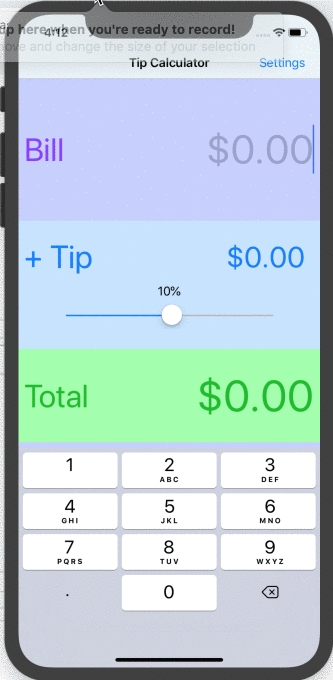
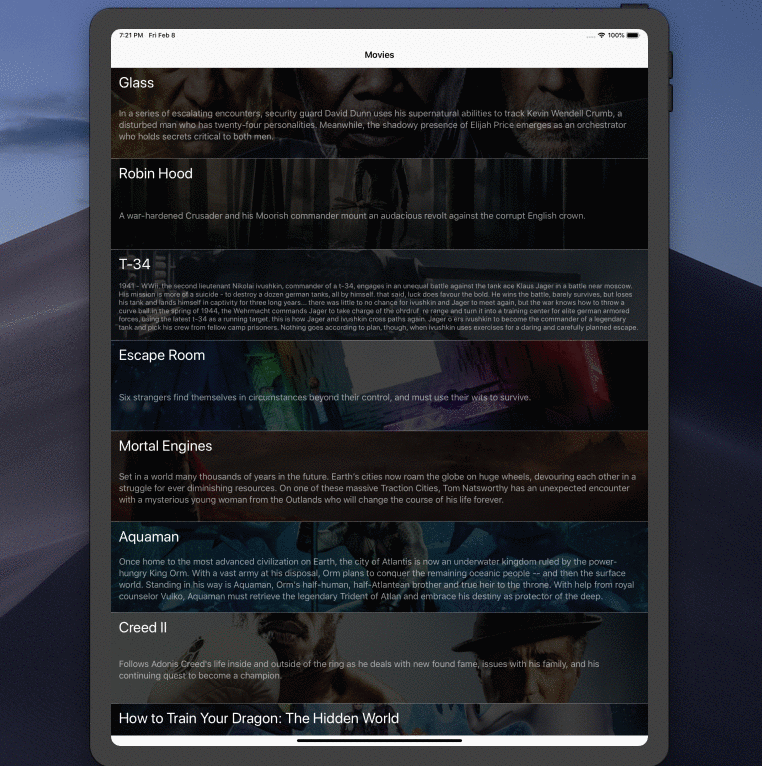
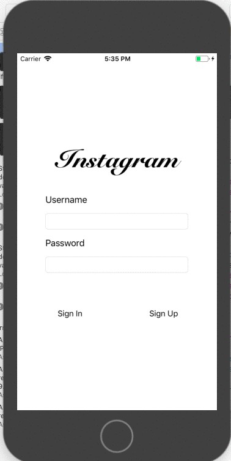
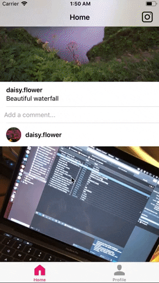

      
    A curated list of UT CodePath iOS student projects, links, and paraphernalia

# UT Spring 2019
## Contents
- [Links](#links)
- [Slides](#slides)
- [Project Showcase](#project-showcase)
- [Course Information](#course-information)

### Links
#### CodePath
- [Course Homepage](https://courses.codepath.com)
- [Discussions](https://discussions.codepath.com)
- [README Workflow](./src/README-Workflow.md)

#### External Links
- [CocoaPods](https://cocoapods.org)
- [Awesome iOS](https://github.com/vsouza/awesome-ios)
- [Awesome iOS UI](https://github.com/cjwirth/awesome-ios-ui)
- [UI Icons](https://thenounproject.com/)
- [Markdown Cheatsheet](https://github.com/adam-p/markdown-here/wiki/Markdown-Cheatsheet)

#### Setup
- [Github Student Developer Pack](https://help.github.com/articles/applying-for-a-student-developer-pack/)
- [git - the simple guide](http://rogerdudler.github.io/git-guide/)
- [Learn Git Branching](https://learngitbranching.js.org/)

## Slides
| Week | Unit | Slides |
|:----:|:----:|:-------:|
|Week 1 | Unit 0/1 | [Lecture](https://docs.google.com/presentation/d/10t2j4NmOawlYy7bUWE0bGsuacl0V8FCSbLN2UTTlPNA/edit?usp=sharing)
|Week 2| Unit 1| [Lecture](https://docs.google.com/presentation/d/1o5LbUP1V5VmZ2tkkZpjA6-c3z5gSdHFPrnA-0KFlJTE/edit?usp=sharing)
|Week 3| Unit 2 | [Lecture](https://docs.google.com/presentation/d/1hYiLbG8bdgNXT50S3I-YvCWNiEV71Evg_ZKfdXA-ixM/edit?usp=sharing)
|Week 4| Unit 3 | [Lecture](https://docs.google.com/presentation/d/1hvkI3xVHM1Iu_Ms9rjoXRt0wk5M7qzPtRG7bnS0BXWs/edit?usp=sharing)
|Week 5| Unit 4 | [Lecture](https://docs.google.com/presentation/d/1kIQ8o3w9DYjRoCZUSrqTUbW6mj9oLc12dchSszRqHtY/edit?usp=sharing)
|Week 6| Unit 5 | [Lecture](https://docs.google.com/presentation/d/19stjqBpl1kF-DGo9ZZHmGv5fmcrHJ1sY1ZWpR1RNjQ0/edit?usp=sharing)
|Week 7| Unit 6 | [Lecture](https://docs.google.com/presentation/d/1Oxbiet3SPm_6xEChBmvNx44hv8PWr72ZKa3_Inpu6Yg/edit?usp=sharing)
|Week 8| Unit 7 | [Lecture](https://docs.google.com/presentation/d/1wmDy1rcloG9-Vvn6L1txZ0K5Yc3cyZJxDp6QacCsBk8/edit?usp=sharing)
|Week 9| Unit 8 | [Lecture](https://docs.google.com/presentation/d/10rHwCmMK5RR9Le6LQxuQSnQxPMCr9yft7gsz6bc59Pk/edit#slide=id.g4c1407d502_0_141)

## Project Showcase
| Week | Lab/Assignment |Project |
|:----:|:--------------:|:------:|
| Pre-Work | Assignment | [TipCalculator](#tipcalculator) |
| 1/2 | Assignment | [Flix](#flix) |
| 3 | Assignment | [Flix II](#flix-ii) |
| 4 | Assignment | [Twitter](#twitter) |
| 5 | Assignment | [Twitter II](#twitter-ii) |
| 6 | Assignment | [Instagram](#instagram) |
| 7 | Assignment | [Instagram II](#instagram-ii) |

---

#### TipCalculator
| Owner | Repo | Demo |
|:-----:|:----:|:----:|
|[Shayna Patel](https://github.com/shaynahpatel)|[Tipper](https://github.com/shaynahpatel/CodePath-tip-calc)||

#### Flix
| Owner | Repo | Demo |
|:-----:|:----:|:----:|
|[Taher Naeem](https://github.com/tahern52)|[Flix](https://github.com/tahern52/Flix)||

#### Flix II
| Owner | Repo | Demo |
|:-----:|:----:|:----:|
|[Yash Kakodkar](https://github.com/YashKakodkar)|[Flixter](https://github.com/YashKakodkar/Flixster)||

#### Twitter
| Owner | Repo | Demo |
|:-----:|:----:|:----:|
|[Amanda Jackson](https://github.com/amandajackson21)|[Twitter](https://github.com/amandajackson21/Twitter)||

#### Twitter II
| Owner | Repo | Demo |
|:-----:|:----:|:----:|
|[Yash Kakodkar](https://github.com/YashKakodkar)|[Twitter](https://github.com/YashKakodkar/Twitter-Client)||

#### Instagram
| Owner | Repo | Demo |
|:-----:|:----:|:----:|
|[Shriprama Rao](https://github.com/shriprama)|[Parstagram](https://github.com/shriprama/parstagram/)||

#### Instagram II
| Owner | Repo | Demo |
|:-----:|:----:|:----:|
|[Yash Kakodkar](https://github.com/YashKakodkar)|[Parstagram](https://github.com/YashKakodkar/Parstagram)||

### Course Information
#### Meeting Times
- **Lecture:** RLP 1.102, 5-7PM
- **Lab:** CBA 4.344, 5-7PM

#### TAs
- [Henry Vuong](https://github.com/mistersquiish) (Lead TA)
- [Benjamin Singer](https://github.com/bzsinger)
- [Somi Singh](https://github.com/sks3)
- [Will Xu](https://github.com/williamx98)

## License

To the extent possible under law, [Benny Singer](https://github.com/bzsinger) has waived all copyright and
related or neighboring rights to this work.
