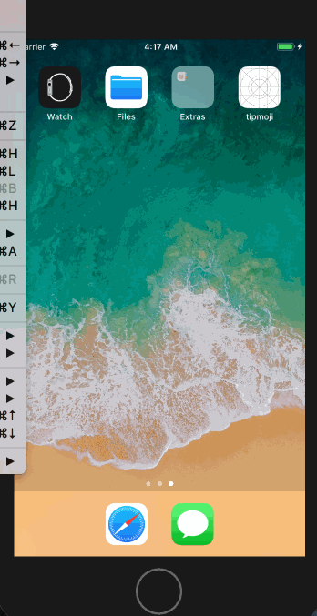
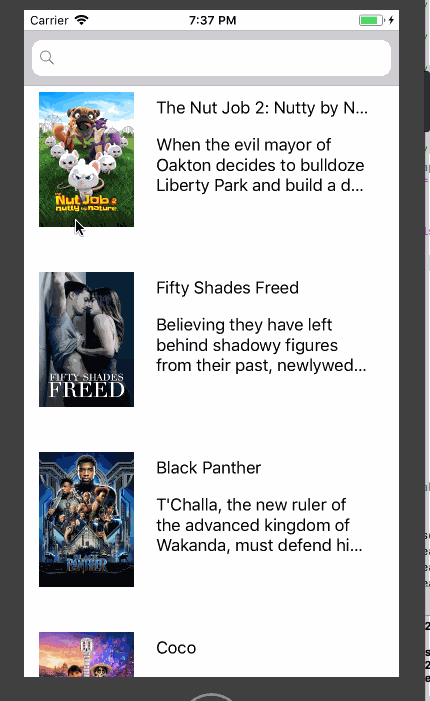
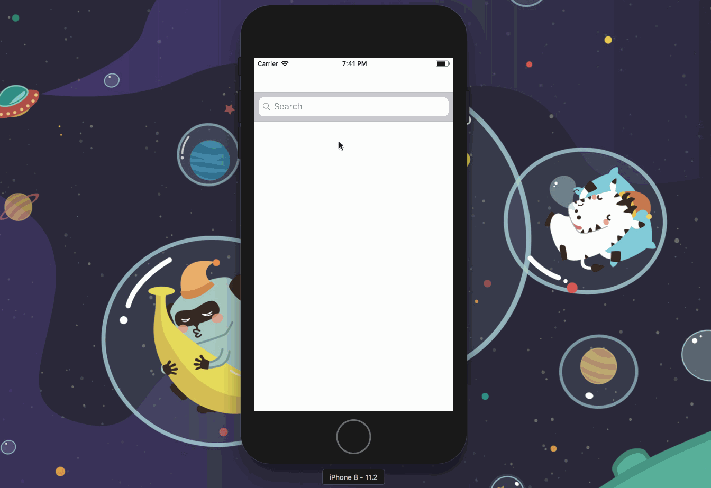
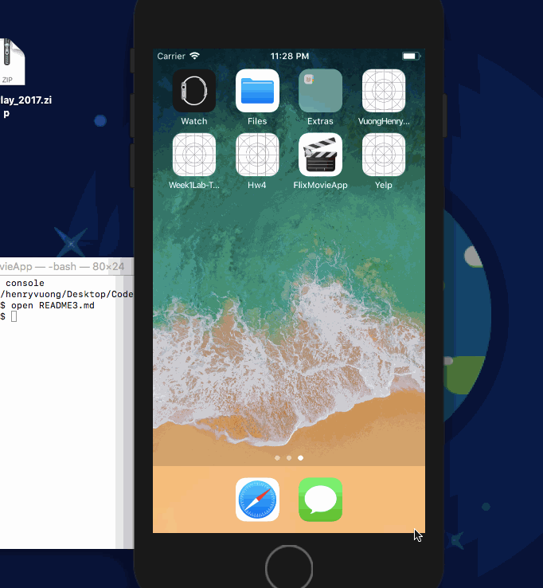

      
    A curated list of UT CodePath iOS student projects, links, and paraphernalia

# UT Spring 2018
## Contents
- [Links](#links)
- [Slides](#slides)
- [Project Showcase](#project-showcase)

### Links
#### CodePath
- [Course Homepage](https://courses.codepath.com)
- [Discussions](https://discussions.codepath.com)
- [README Workflow](./src/README-Workflow.md)

#### External Links
- [CocoaPods](https://cocoapods.org)
- [Awesome iOS](https://github.com/vsouza/awesome-ios)
- [Awesome iOS UI](https://github.com/cjwirth/awesome-ios-ui)
- [Markdown Cheatsheet](https://github.com/adam-p/markdown-here/wiki/Markdown-Cheatsheet)

#### Setup
- [Github Student Developer Pack](https://help.github.com/articles/applying-for-a-student-developer-pack/)
- [git - the simple guide](http://rogerdudler.github.io/git-guide/)

## Slides
| Week | Lecture | Lab |
|:----:|:-------:|:---:|
| Week 1 | [Lecture](https://docs.google.com/presentation/d/10HF-T4uNhsdN8q8sPR-NFm5V8TTp22zc0OSovqfM334/edit?usp=sharing) | [Lab](https://docs.google.com/presentation/d/1NCk-o508VwRqR4Q6D2tPxyOzrwTy5FLvvbZh-U-CbOE/edit?usp=sharing)
| Week 2 | [Lecture](https://docs.google.com/presentation/d/17oBn3XG4OFO_A2t8mDwyNzlCDJXqGmId-RJIvHSJBGM/edit?usp=sharing) | [Lab](https://docs.google.com/presentation/d/1c620bYoPRXtdczPHzWgFkMDxdkCpbRb_lrjPq2QgK3A/edit?usp=sharing) |
| Week 3 | [Lecture](https://docs.google.com/presentation/d/1QU0X6u1ZUWAyznPjbizlFfX9XDZRZuv5kFAP4QfpMFw/edit?usp=sharing) | [Lab](https://docs.google.com/presentation/d/1goQnYsApp6M3VrfW2iYJUrHi_BWwpWv2Y39rQl9d7s8/edit?usp=sharing) |
| Week 4 | [Lecture](https://docs.google.com/presentation/d/1QyL9QekgxPUPk1jZ8b_DYdsgCWS3NzRNAUwJhiRCxTg/edit?usp=sharing) | [Lab](https://docs.google.com/presentation/d/1VGA-7YI0BqKu98pWN2_CeKG6HflugZUfmd0B-YJM9kg/edit?usp=sharing) |
| Week 5 | [Lecture](https://docs.google.com/presentation/d/1hmMOpCtod0FxbGhueuszmsX-xE5VAD8RhTeQj8TQnxw/edit?usp=sharing) | [Lab](https://docs.google.com/presentation/d/1VGA-7YI0BqKu98pWN2_CeKG6HflugZUfmd0B-YJM9kg/edit?usp=sharing)

## Project Showcase
- [TipCalculator](#tipcalculator) - Pre-Work
- [Flix](#flix) - Assignment 1
- [Tumblr](#tumblr) - Lab 1
- [Flix 2.0](#flix-20) - Assignment 2
- [Tumblr 2.0](#tumblr-20) - Lab 2
- [Yelp](#yelp) - Assignment 3
- [Flix 3.0](#flix-30) - Lab 3

#### TipCalculator
| Owner | Repo | Demo |
|:-----:|:----:|:----:|
|[Somi Singh](https://github.com/sks3)|[Tipster](https://github.com/sks3/tipster)||
|[Rishi Talati](https://github.com/apprishiate)|[TipMoji](https://github.com/apprishiate/Tipmoji-App)||

#### Flix
| Owner | Repo | Demo |
|:-----:|:----:|:----:|
|[Tianyu Liang](https://github.com/Tianyu-Liang)|[Flix](https://github.com/Tianyu-Liang/Flix)||

#### Tumblr
| Owner | Repo | Demo |
|:-----:|:----:|:----:|
|[Somi Singh](https://github.com/sks3)|[PictaStream](https://github.com/sks3/pictastream)||

#### Flix 2.0
| Owner | Repo | Demo |
|:-----:|:----:|:----:|
|[Somi Singh](https://github.com/sks3)|[CinemaBoss](https://github.com/sks3/cinemaboss)||

#### Tumblr 2.0
| Owner | Repo | Demo |
|:-----:|:----:|:----:|
|[Somi Singh](https://github.com/sks3)|[PictaStream](https://github.com/sks3/pictastream)||

#### Yelp
| Owner | Repo | Demo |
|:-----:|:----:|:----:|
|[Fei Zhang](https://github.com/chloe415)|[Yelp](https://github.com/chloe415/Yelp)||

#### Flix 3.0
| Owner | Repo | Demo |
|:-----:|:----:|:----:|
|[Henry Vuong](https://github.com/mistersquiish)|[Flix](https://github.com/mistersquiish/FlixMovieApp/blob/master/README3.md)||

## License

To the extent possible under law, [Benny Singer](https://github.com/bzsinger) has waived all copyright and
related or neighboring rights to this work.
